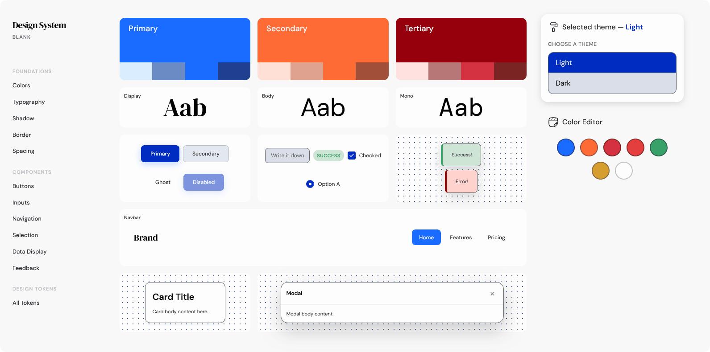

# Blank — Design System

A single-page design system demo with OKLCH-based color tokens, M3 color roles, light/dark theme switching, and a live color editor.

## Quick Start

Open `src/index.html` in any modern browser. No build step required.

## Features

- **7 source base colors** — primary, secondary, tertiary, error, success, warning, surface — with all derivatives auto-computed via `oklch(from ...)` relative colors
- **M3 color roles** — containers, on-colors, surface variants, outlines, inverse surface [Material 3](https://m3.material.io/styles/color/roles)
- **Light/dark themes** — separate `:root` / `[data-theme="dark"]` blocks, switchable from the theme panel
- **Live color editor** — click a base color swatch to open a native picker; changes cascade to every token automatically
- **Surface tinting** — surface roles inherit primary's hue at low chroma (not achromatic grey)
- **Full component set** — buttons, inputs, navigation, selection controls, data display, feedback/overlays
- **Patterns page** — 7 layout skeletons (auth, search, onboarding, data table, empty states, settings, cart)
- **Pages page** — 6 full-page skeletons (dashboard, PDP, pricing, profile, 404, analytics)

## Structure

| Path | Contents |
|---|---|
| `src/index.html` | Single-page demo, theme panel, color editor |
| `src/styles/core.css` | All design tokens, M3 roles, utilities |
| `src/styles/components.css` | Component styles |
| `src/styles/view.css` | Shared view layout (navbar, grid, card, skeleton) |
| `src/icons/icons.css` | SVG icon classes |
| `src/patterns.html` | Pattern layout skeletons |
| `src/pages.html` | Full page skeletons |
| `Design System.md` | Full design system reference |

## Browser Support

Chrome 111+, Firefox 113+, Safari 15.4+ (requires `oklch()` support).

## Asseets
### Icons
[Solar Icons](https://www.figma.com/community/file/1166831539721848736/solar-icons-set) by 480Design
